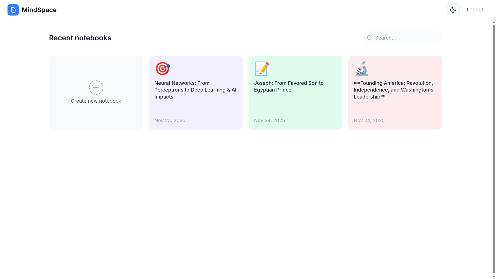
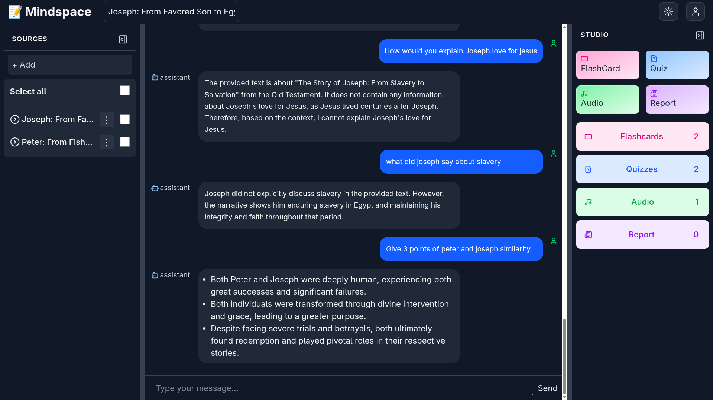

# MindSpace

MindSpace is a comprehensive, AI-powered productivity and learning platform designed to enhance study and work workflows. It combines intelligent chat, automated flashcard generation, quiz creation, and audio synthesis within a fully containerized environment.

---

*Intelligent workspace for all your learning needs.*



*Interactive Chat Interface.*


---

# Features

1. **Intelligent Chat**: Interactive interface with RAG capabilities via pgvector for context-aware conversations.
2. **Study Tools**: Automated flashcard, report, and quiz generation powered by Google Gemini.
3. **Content Management**: Robust document analysis via Apache Tika and structured report generation.
4. **Audio Features**: Integrated text-to-speech and audio processing for hands-free learning.
5. **Secure Authentication**: JWT-protected registration and login system ensuring data privacy.


# Tech Stack

### Backend
- **Language**: Java 21
- **Framework**: Spring Boot
- **Database**: PostgreSQL with pgvector extension
- **Security**: Spring Security with JWT
- **Build Tool**: Maven (containerized)

### Frontend
- **Framework**: React 19 (Vite 7)
- **Language**: TypeScript
- **Styling**: Tailwind CSS 4
- **State Management**: Zustand

# Prerequisites

The application is fully containerized. To run the project, you only need:
- **Podman** (preferred) or **Docker**
- **podman-compose** or **docker-compose**

### Environment Configuration

Create a `.env` file in the project root directory to manage your credentials and secrets. This file is required for the containers to initialize correctly.

```env
DB_USERNAME=your_db_user
DB_PASSWORD=your_db_password
GEMINI_API_KEY=your_google_gemini_api_key
JWT_SECRET_KEY=your_secure_jwt_secret
```

### Quick Start

1. **Build and Start the Application**
Run the following command from the project root to build the images and start all services (Database, Backend, and Frontend):

```bash
podman-compose up --build -d 
```

2. **Access the Application**
Once the containers are healthy:
- **Frontend UI**: http://localhost:8081
- **Backend API**: http://localhost:8080
- **Database**: localhost:5435 (External access)

# Project Structure

```text
MindSpace/
├── backend/            # Spring Boot application & Dockerfile
├── frontend/           # React application & Dockerfile
├── docker-compose.yml  # Container orchestration
└── .env               # Environment variables (Not committed to VCS)
```

# License
MIT
